# PROJECT 2

We have completed all the two parts of the project..Below is the file structure of the project.

We choose number of Nodes as N=3 (A,B,C)

	.N-NodeDistributedSystem (Main Folder)
    ├── src (Contains All the class files for Part1 and Part2)      #Folder
	|	├── NodeA.java  (Contains Berkly Implementation)
	| 	├── NodeB.java  (Contains Berkly Implementation)
    |   ├── NodeC.java   (Contains Berkly Implementation)
    |   ├── ClientServerInterface.java (Contains Berkly Implementation)
    |   ├── VectorNodeA.java (Contains Vector Implementaion)
    |   ├── VectorNodeB.java (Contains Vector Implementaion)
    |   ├── VectorNodeC.java (Contains Vector Implementaion)
    |   ├── VectorInterface.java (Contains Vector Implementaion) 
	├── Images (Conatains the Screenshots of Project outputs)            
    |
    └── ... README.md

**NOTE:** <br>

* The project is Implemented by Using JAVA RMI

## Part1 Berkely Implementation
## NodeA
### Supporting Operations
* Send Message to Node B and NodeC
* Synchronize the All nodes
  
### Starting NodeA
1.Open Terminal <br>
2.Go to Downloaded Project Directory

Perform the below operation to start the server

```bash
	1.cd cd N-NodeDistributedSystem/src
	2.javac *.java
	3.java NodeA
```
### NodeA Start Output

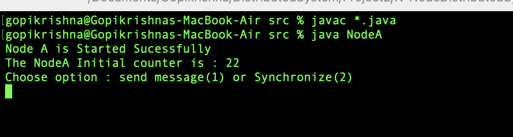

## NodeB
### Supporting Operations
* Send Message to Node B and NodeC
* Synchronize the All nodes
  
### Starting NodeB
1.Open Terminal <br>
2.Go to Downloaded Project Directory

Perform the below operation to start the server

```bash
	1.cd cd N-NodeDistributedSystem/src
	2.javac *.java
	3.java NodeB
```
### NodeB Start Output

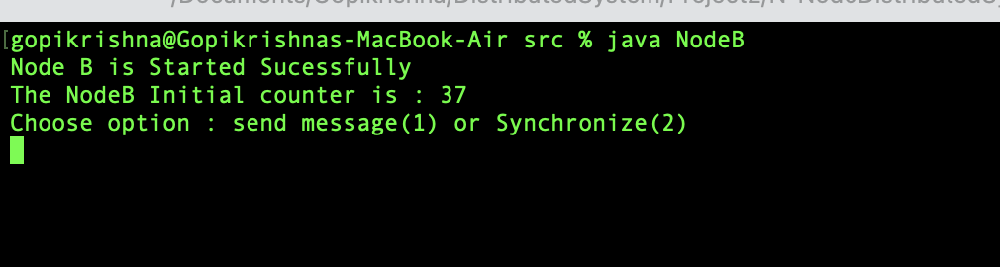

## NodeC
### Supporting Operations
* Send Message to Node B and NodeC
* Synchronize the All nodes
  
### Starting NodeC
1.Open Terminal <br>
2.Go to Downloaded Project Directory

Perform the below operation to start the server

```bash
    1.cd cd N-NodeDistributedSystem/src
	2.javac *.java
	3.java NodeC
```
### NodeC Start Output

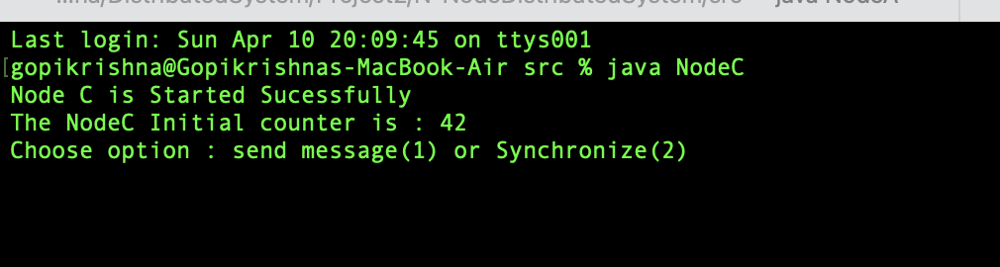

## Synchronizing the Clocks
1.Go to Node A tab in terminal<br>
2.Choose the option 2

### NodeA Sync Output

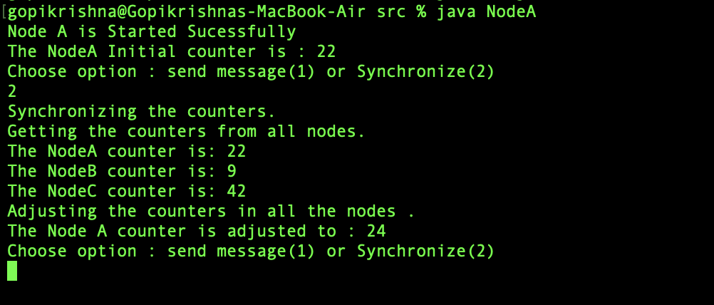

### NodeB Sync Output

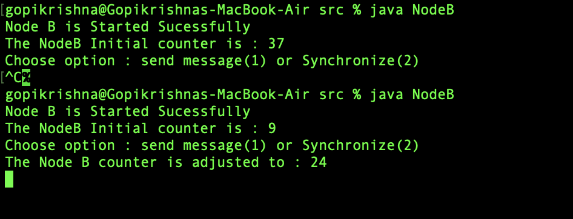

### NodeC Sync Output

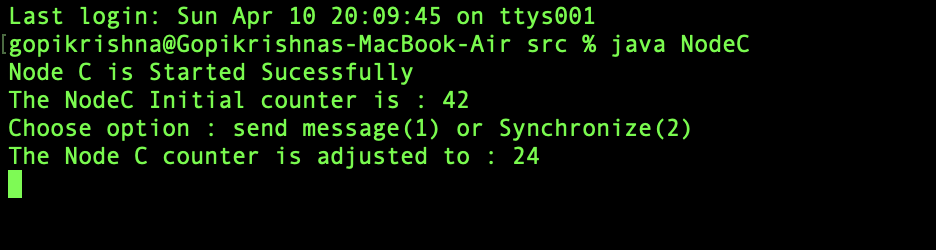


## Part2 Vector Implementation
## VectorNodeA
### Supporting Rule
* When a message is sent or received timer counter will be increased by 1
* When Internal event happens timer counter will be increased by 1
  
### Starting VectorNodeA
1.Open Terminal <br>
2.Go to Downloaded Project Directory

Perform the below operation to start the server

```bash
	1.cd cd N-NodeDistributedSystem/src
	2.javac *.java
	3.java VectorNodeA
```
**NOTE:** The Berkely servers Should be up while running vector
### VectorNodeA Start Output
Initially we are synching the vector values from the berkly
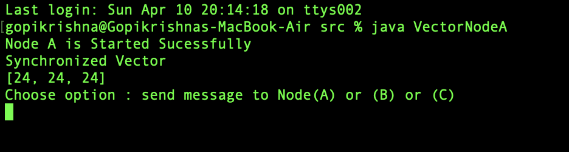

## VectorNodeB
### Supporting Rule
* When a message is sent or received timer counter will be increased by 1
* When Internal event happens timer counter will be increased by 1
  
### Starting VectorNodeB
1.Open Terminal <br>
2.Go to Downloaded Project Directory

Perform the below operation to start the server

```bash
	1.cd cd N-NodeDistributedSystem/src
	2.javac *.java
	3.java VectorNodeB
```
**NOTE:** The Berkely servers Should be up while running vector
### VectorNodeB Start Output
Initially we are synching the vector values from the berkly
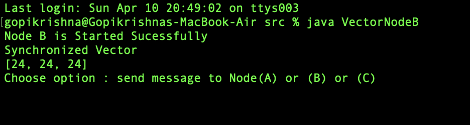

## VectorNodeC
### Supporting Rule
* When a message is sent or received timer counter will be increased by 1
* When Internal event happens timer counter will be increased by 1
  
### Starting VectorNodeC
1.Open Terminal <br>
2.Go to Downloaded Project Directory

Perform the below operation to start the server

```bash
	1.cd cd N-NodeDistributedSystem/src
	2.javac *.java
	3.java VectorNodeC
```
**NOTE:** The Berkely servers Should be up while running vector
### VectorNodeC Start Output
Initially we are synching the vector values from the berkly
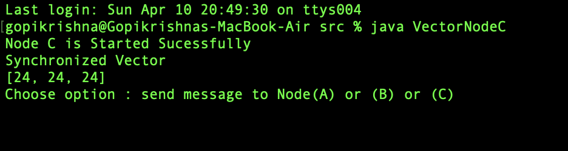

## Sending Message from VectorNodeA to VectorNodeB
1.Go To Terminal of VectorNodeA <br>
2.Enter B 

## VectorNodeA Output
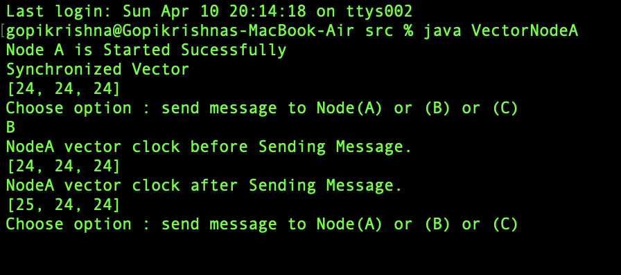

## VectorNodeB Output
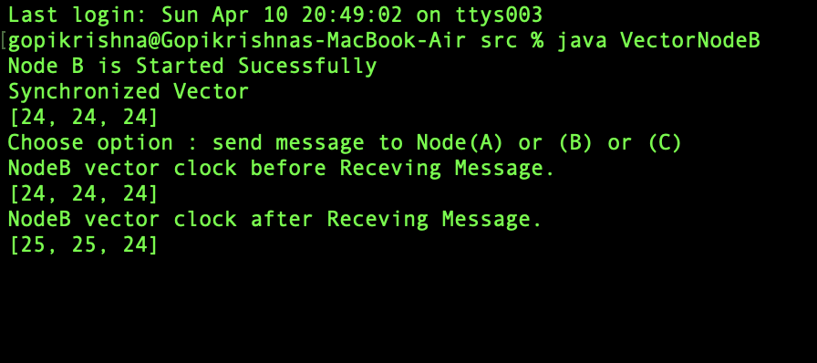

## Sending Message from VectorNodeB to VectorNodeC
1.Go To Terminal of VectorNodeB <br>
2.Enter C

## VectorNodeB Output
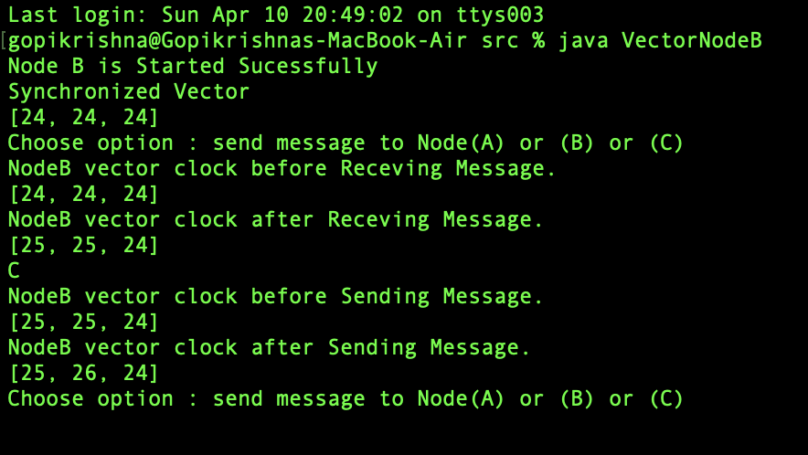

## VectorNodeC Output
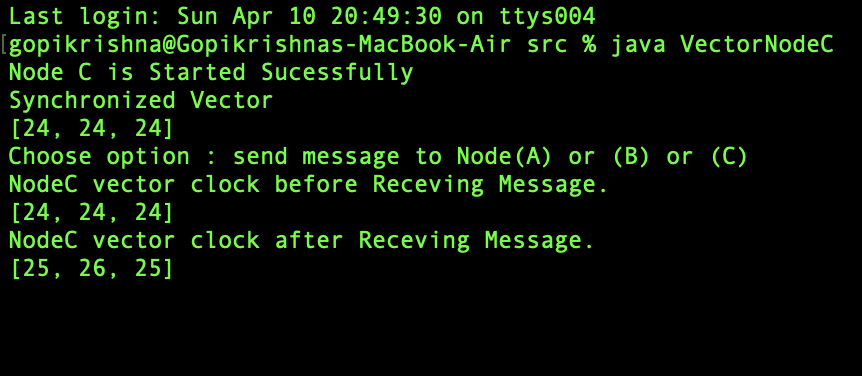